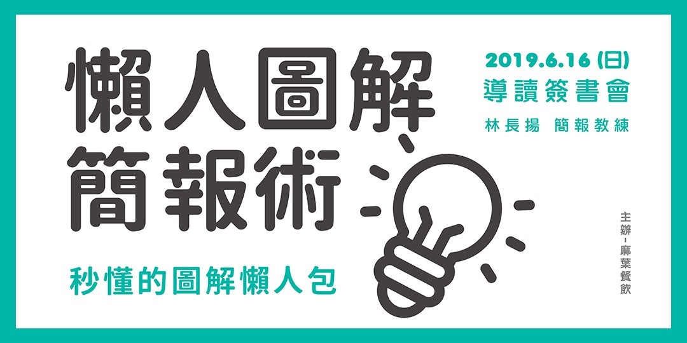
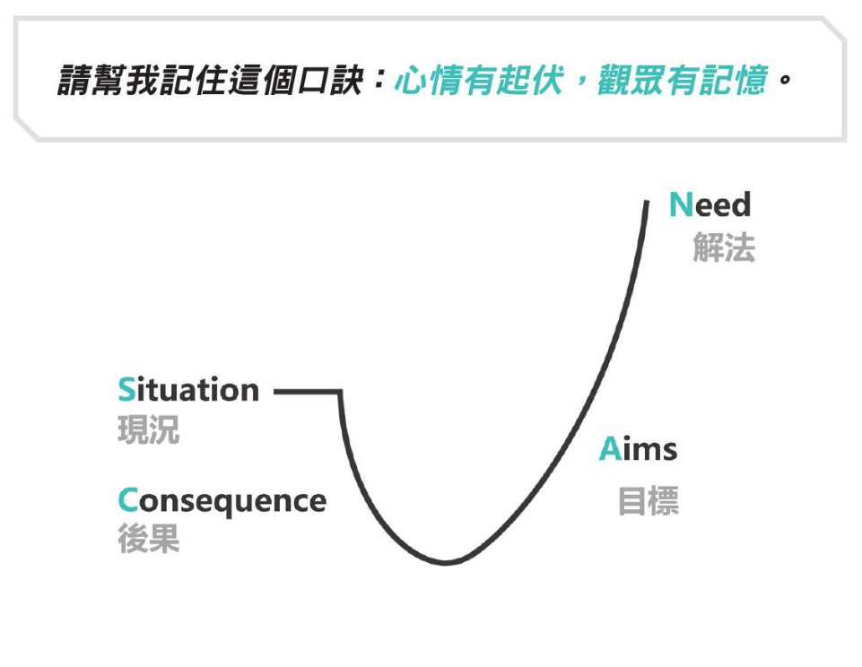

# 《懒人图解简报术》读书笔记

### 1 缘起

​	信息可视化，俨然是未来趋势。**图解呈现**，为其一例，并已流行多年。**懒人包**，顾名思义，是 “让没时间、精力的懒人也能使用的封包” ，而在信息领域，懒人包指的是有人热心地将一个事件整理成简要、完整的说明，以便一般人快速了解事件始末、详情。近年来，懒人包用途在新闻、传媒领域，日益普及。

<!--more-->

​	事实上，各领域通用的传媒与教育通用工具——**简报**，也是使用视觉呈现信息的一种管道。**若能善用图解技巧，结合懒人包概念，制作简报，让每份图解简报在有或没有主讲人的情况下，都能发挥更大优势**，那么，各领域的人，都有机会，**通过大量生产该领域的懒人图解简报，建立自己的品牌和知名度**，以自身专业且独特的信息，交换读者或观众的信任。

​	简报的重点不在于设计，有的简报课程胡里花俏，把普通人培养成专业设计师，但其实，这样的简报往往复用性不高，沦为消费品，性价比和时间回报率太低了。从另一个角度来说，非设计师出身，半路出家的我们，耗时费力，也不容易在这方面胜得过人家的专业。

​	因此，对一般简报制作者来说，**简报的重点，应该以观众为首要；其次则是内容**。懒人图解简报概念提出者，林长扬认为，**懒人图解简报的核心，在于省时和促进行动**，只要你有一颗**分享知识的心**，就可以制作懒人图解简报。而我，从《懒人图解简报术》一书中，最大的收获是，使用 “**扁平化图示**” 制作图解简报的概念。

---

### 2 森林

上文说到，懒人图解简报的重点，应该**以观众为首要；其次才是内容**。这是因为，懒人图解简报的目的，是为了让观众了解他们原本不懂的东西。为此，简报的标题、内容、版面等，都需要从他们的角度出发。因此，比起简报知识含量，发想懒人图解简报的内容之前，**第一步，我们要先剖析观众**。

#### 但丁，你指导的对象

剖析观众，重点在于，思考**你真正想锁定的是哪些人？**知道我们的产品是要卖给谁，我们的产品才有卖点和市场。懒人图解简报和观众的关系亦是如此。

**剖析观众，三步走起：**

> **设定群众  →  走入人心  →  预测问题**

**设定群众，是为了收集观众背景资讯**，这样，我们才能**用他们了解的语言、故事和场景，来讲他们不懂得东西，让他们有熟悉感，帮助理解**。例如，观众的**年龄**，设想观众的年龄后，才能去思考这个年龄层的人经历过什么、他们的背景是什么、他们的喜好是什么，从而发想更精准的懒人图解简报。就像我本身的图解简报，主要是针对初中、高中学生制作的语文、数学、理科考纲知识点简报，若不走进青春期少女少年的世界，一味用传统教学方式对他们灌输知识，无法引起学生学习动机、吸引他们的眼球和注意力，这样的做法，未必是更优解。如果不是针对考生制作的懒人图解简报，其他需要收集的信息，还包括观众的**职业、兴趣、动机**等等。

**走入人心，是为了换位思考**。收集了观众的背景信息，这时，我们对于 “要把知识点讲给谁听” ，这对象的面貌，已经相对清晰。现在，我们要抓住他们 “害怕” 或 “渴望” 的东西，催动人最基本的驱动力，让他们产生强大的力量。换句话说，在发想懒人图解简报时，若能发现观众心里害怕或渴望的事，我们就能赋予懒人图解简报更大的意义，这么一来，观众才会把它放到心里面，并留下深刻印象，且还会愿意去散播分享。

**预测问题，是为了让观众觉得 “他好懂我！”** 经过收集背景信息，拼凑观众大致面貌，深入探讨他们内心害怕或渴望的事之后，我们就能进一步设想他们想问的问题，以便更精准地发想内容，并在情节设计上，先把这些疑问给问出来。这么一来，作者和观众的距离，在无形中拉近，观众能不发出赞叹吗？ “哇，这个作者怎么知道我心里在想什么，他好懂我！”

到这里，你已经知道这片森林的大致走向，不再是盲目乱闯。无论是标题撰写、内容发想、版面设计疑惑图像思考等，你都可以很快完成。因为，你已经有一个明确的目标，知道这份懒人图解简报到底是要做给谁看的了。

简单来说，**懒人图解简报的核心，在于分享知识，达到省时和促进行动**的效果。剖析观众，相当于拆掉作者和观众之间的墙壁，让你变成观众的专业朋友、让他们听得懂你说的话、让他们认为你知道他要什么、让他们认为，你拥有真正的专业，可以帮助到他们。

勾勒出观众的大致面貌，你可以针对他们的需求做出适当的标题或版面，达到吸睛效果；你也可以避免知识的诅咒， “对他们讲人话” ，用他们懂的语言，讲解他们不懂得东西，令他们不仅有熟悉感和代入感，还会快速理解和吸收你要传递的知识，并留下深刻印象。你甚至在制作懒人图解简报时更加省时省力，因为，你已经有了相对具体的制作目标，不会再盲目随心所欲，加入更多无效的内容、设计、图片……

#### 维吉尔在森林中的地图

接下来，我们就可以挪步到简报 “**内容**” 的部分了。

本书作者提醒，为打破知识诅咒，节省彼此时间，在盘点资源、对观众深度剖析之后，必须**思考懒人图解简报如何让观众易懂**。易懂的第一步，就是 “**整理**” ，**确保懒人图解简报的内容都是观众需要的**。换句话说，我们需要找到 “自身专业” 与 “观众需要” 的交集，这时取舍就非常重要。

这时，拥有一套大致框架作为每次主题的参考，能方便筛选内容。结合上一步剖析观众之后，掌握到观众 “害怕” 或 “渴望” 的信息，作者总结了一套 SCAN 法则。

由于懒人图简报大多是做给非专业的人看的，因此**要做到老妪能解**。

**SCAN 法则**与**让内容通俗易懂**的做法，下文将一一介绍。

##### 他知道的层级

简报的参照框架，对作者来说，能帮助作者快速有效筛选出简报内容；对观众来说，则能在他们脑中建立清楚框架，达到便于理解的目的。

作者总结的 **SCAN 法则**，就像说故事的情节线，有高低起伏，目的是用架构牵动观众心情，进而带动观众情绪起伏，让他们感受到高潮迭起的刺激与惊喜。这样，他们印象更深、更有记忆。

SCAN 法则的字母，分别代表其四个组成成分的首字母，每个部分伴随着一条心情起伏的曲线：

1. **S**ituation（现况）：现在发生什么事？简洁的向观众说明现状，它能带动观众感受到自己也身在其中的心情；
2. **C**onsequence（后果）：上述的情形会导致什么事发生？它能影响观众心情开始沉到谷底，感受到改变的必要；
3. **A**ims（目标）：为了避免或达到上述的后果，我们可以怎么做？它使观众开始看到曙光，心情逐渐从谷底爬升；
4. **N**eed（解法）：想达到这个目标，我们该怎么实际进行？它让观众感受到自己全新的改变，心情提升到比一开始的现况更高的高峰，创造最后的高潮。

SCAN 法则可分为两大区块，第一区块是 Situation （现况）与 Consequence （后果），目的是吸引观众上钩，让观众想看，并且继续看下去。第二区块是 Aims （目标）与 Need （解法），这部分是整份懒人图解简报的精华。要给观众的知识、观点、好用的步骤…… 等都在这里，是要让观众豁然开朗、在短时间获得大量好知识的重点。

SCAN 法则架构的具体内容，请参照以下表格：

| 架构                 | 具体内容                                                     |
| -------------------- | ------------------------------------------------------------ |
| S / Situation 现状   | 作为开头，要简洁快速地说明这份懒人图解简报是要讲什么，因此建议利用**故事、场景、案例**…… 等来做开头，让观众能很快地进入情境，并且有性趣继续看下去。此外，也可以用 “**点出问题**” 的方式让开头更加加分——**让对方知道这是迫切要解决的问题，才会吸引对方看下去**。 |
| C / Consequence 后果 | 点出问题之后，接着说明这个问题会造成什么后果。——如果问题跟自身没有什么相关，也不会造成任何危害的话，大多数人就不会放心思在上面。这阶段的目的，是用 “后果有可能危害到观众本身或是他们的亲朋好友” 来提高观众的关注度，并且牵动他的心情。此外，在这一步做到 “打进心里” ，便可达到 “心情有起伏，观众有记忆” 的效果。可从 **“害怕” 或 “渴望”** 两点着手。 |
| A / Aims 目标        | 提出目标，为观众说明如何避免刚刚提到的后果（或是达成他们的渴望），而且这个目标最好能对观众来说是个独特的观点。——**懒人图解简报最大的特色，就是作者浓缩淬炼过的知识**，因为每个人专业领域不同、诠释的方法不同，因此产出的作品都是独一无二的。否则，这份懒人图解简报就没有价值了。——当你要**制作一份懒人图解简报时，请先想想，关于这个主题，我有什么最特别的东西可以放进去，这就是让我的懒人图解简报与众不同的核心**。 |
| N / Need 解法        | 解法，就是 “**实际可行的步骤**” 。学习最后一环就是 “行动” 或 “运用” ，否则，就会忘掉啦！懒人图解简报除了能让观众们在短时间内获得大量好知识之外，最好还能引发改变，促进观众实际行动。—— “实际可行的步骤” 能降低观众行动的门槛，让观众看完就能做、会做，行动了，观众自然就更容易记住。  - 什么主题，都要帮观众规划步骤，建议把步骤切分的小一点，观众行动的几率就越高，这份懒人图解简报的价值就很高！  - **如何把步骤切小一点？**秘诀就是**讲人话**——**原始知识 → 拆解转化 → 一看就懂**。 |

为了方便读者参考，《懒人图解简报术》作者林长扬在书中也总结出十种常见的具体主题简报框架，读者们有兴趣可以参考看看。我的看法是，不论哪个主题的知识传递，本质上多是关联观众，引起他们的兴趣，告诉他们这事对他们有哪些好处，然后再带着观众一起行动。

##### 每层级的介绍

有了作为简报内容骨干的架构，我们就可以继续填充内容的血肉。再次重申，不论是简报框架，还是具体内容，我们的目的，都是让知识的传递通俗易懂、老妪能解，这样观众才能记住这些内容，这场沟通交流，才更高效。

这时，我们需要用观众听得懂的话，来讲他们不懂的东西。我们剖析观众的优势，现在就能发挥出来。

了解了观众的背景、他们知道的事、他们会感兴趣的事物，我们就能利用**譬喻**、**转化**的方式，让艰深的专业术语变成观众好吸收的内容。在实际操作上，我们可以利用 “**故事**” 跟 “**经验**” 来协助转化内容，因为故事跟生活经验都已经存在观众脑海里，只要把专业术语跟故事经验做连结，观众就能很快的了解我们讲的是什么！例如，童话故事。

我们的目的：**故事 →  转化 → 秒懂**。

林长扬建议，利用简单的故事，就能有效的让顾客**了解要讲的内容**，并且给顾客自己做选择，这就是故事的好处。除了故事，我们也可以利用观众日常生活的经验来辅助说明，借此产生熟悉感，并且让观众秒懂！因此，制作懒人图解简报时，**不要用专业来解释专业**。在实际制作时，请先检查懒人图解简报的内容，看看有没有太多专业术语，请一一的挑出来并且中翻中，利用 “故事” 跟 “经验” 转化成平易近人的内容，观众看得秒懂，吸收了好知识，懒人图解简报才有价值！

在内容部分，给大家最后的提醒，懒人图解简报，除了 “懒人” 代表的 “简单易懂、省时高效” 的目的，及 “简报” 所表示的传递方式外，其中的 “图解” 这个重要呈现方式和元素，也不容忽略。图解方面的攻略，将于本文下节叙述。

到这里，结合上述内容，我们给大家总结一下，懒人图解简报术的三大原则：

| 懒人图解简报术三大原则 | 目的                               | 做法                                                         |
| ---------------------- | ---------------------------------- | ------------------------------------------------------------ |
| 用图不用文             | 达到 “图优效应” 以增加记忆         | 选图三原则：高画质图片； 高相关性； 好记忆。                 |
| 复杂变简单             | 让观众一看就懂                     | 一看就懂三原则：   1. **架构**：利用引人入胜的架构引导观众；  2. **内容**：将知识淬炼转化，让观众一看就懂；  3. **图片**：做到排版整齐，没有视觉上的压力。 |
| 不用面对面             | 让观众在没有讲者的情况下，也能看懂 | 别做：不要复制剪贴； 不要过于琐碎； 要做：  譬喻； 故事； 转化。 |

记住，这个环节，我们的目的是在**开始制作懒人图解简报之前，写下简报架构与精华内容，以便于后续快速制作**。

---

### 3 面包屑

简报有了骨干和血肉，我们就要开始为简报画上一层简约好看，让人赏心悦目的表皮啦！

#### 内容

承接前文强调的，内容应该简洁易懂，在我们安排简报内容时，自然不可忽略能让观众好消化的内容分量。最好，遵守简报**一张一重点**的原则，以免太多字。

我们可以将原始内容拆分成小段落，让观众好消化。

首先，将原始内容在电脑上直接拆分，并在每个段落钱加上编号。文字量较大的懒人图解简报版面，文字内容请控制在 **60个字以下** ，就能兼顾资讯清楚与画面美观。如果真的有很多话要说，需要多点字数才能说明清楚，那极限就是 **90个字**。

编码就是懒人图解简报的页码，你可以借此看看自己的懒人图解简报是否页数太多了。一份懒人图解简报**不要超过 40 页**，不然会让观众看得很累，因此如果在拆分内容时发现页数很多，建议可以改写内容，或是将其拆成好几份懒人图解简报，以免让观众的负担太大。

#### 排版

前面的准备，让正式的图解简报制作，变得高效快速。只需把内容文字转换成图像即可。

这时，需注意，图解简报的核心原则：**简洁，就是美**。这是因为，比起主观的美，和设计师的经验与境界相比，做到 “简洁” ，是我们能达到且相对高效的成果。

要做出简洁的图解简报，排版时，技巧有三，**对齐**、**留白**与**色彩**。

**对齐**，是因为人很喜欢看画面上看起来不太一样的地方。这样的话，大脑就很容易因这些地方分散注意力，很耗费脑力资源。所以，简洁的图解简报，让观众节省更多脑力去理解内容。做法也很简单，只需用插入直线的方法，把页面所有元素的直线与竖线都对齐即可。

**留白**，可以创造负空间，让观众的视觉上不会有压迫感，并让他们从资讯爆炸的窘境中脱离出来，获得片刻喘息。遵守一个原则——每张简报只放一个重点。此外，记住 80% 法则，圆框、简报里面的图尽量不要超过框内面积的 80%。简言之，懒人图解简报，排版时，**一张放一重点，上下左右留白**。

**色彩**，是用以凸显重点，达到吸睛效果。色彩，是图解简报的图像运用以外，另外一项能吸睛的做法。故颜色的选择，可以是工作还是自己专业的颜色、自己喜爱的颜色或是自己个性的颜色。统一颜色的目的，是长久使用，以形成自己的固定风格，有助于建立个人品牌。配色方面，以选定的颜色，去专业色彩网站寻找使用的配色方案即可。须注意的是，图解简报要避免使用饱和度和亮度太高的颜色，避免长期盯着会感到刺眼。选色，应该做到 **鲜艳而不刺眼** 。

另外，制作图解简报时，搭配颜色的大原则只有一个，那就是 **中性色 + 强调色** 。中性色为黑白灰，没有太强的存在感，却能衬托其他颜色。强调色则是前面选出来的主颜色。需注意，强调色尽量不要超过两个，最好只用一种强调色，以不模糊焦点，更明确突出重点。中性色加强调色的做法，原理为格式塔完形心理学。

#### 重中之重的扁平化图示

截至目前，我们已经了解，制作懒人图解简报，是本着一颗分享知识的心，让观众了解他们原本不懂的东西。这时，精准定位受众并掌握他们渴望与害怕的事物，让我们能更好地跟他们沟通分享，甚至预测问题，来有效解决他们的痛点，最后达到节省他们的时间又促进他们行动的结果。此外，分享知识的本质，让我们无法忽略内容这一重要项目。这时，我们需要建立一套框架，如作者分享的 SCAN 法则，提升沟通效率之余，也便于批量制作图解简报。如此，每份图解简报在有或没有主讲人的情况下，都能发挥更大优势，那么，我们进而得以建立自己的品牌，获得知名度，以自身专业且独特的信息，交换读者或观众的信任。

最后，我们来谈谈作者在这本书独到的分享，也是我个人收获最大的概念，**扁平化图示**。

对于为什么图解简报的用图应选择扁平化图示？本书作者林长扬认为，制作图解简报，选择扁平化图示，是为了**让观众快速理解，形成秒懂的优势**。扁平化图示不止吸睛、让观众秒懂，还有简洁和带有亲切感的优点，比起风格各异的高清大图，可谓更好的选项。

图像或影像，也属于资讯的一种，太多的话，比如一张高清全景照片，美则美矣，其实会让人疲乏。这时候，扁平化这种简单、不用花费太多脑力的图示，就容易吸引观众的注意力了。由于图示的单一、简洁形象，比起复杂的照片，资讯就更简洁、突出及明了。更让人惊喜的是，在一般情况下，图示甚至有跨语言高效沟通的效果。

因此，跟内容互相辉映的扁平化图示，可以帮助观众更快速理解我们图解简报要说的重点。简而言之，懒人图解简报，除了文字、架构、排版、颜色以外，图像或影像，也是内容的一部分，我们需要统一思维角度，遵从 “简洁以为对方省时省力” 的原则，高效促使对方理解和行动。

况且，对简报作者的我们而言，比起花非常多时间去找相对应的图来跟文字搭配，能发挥的空间还很少，甚至做不到想要的效果相比，用扁平化图示省时高效多了，而且还能统一整份或多份简报的风格，一举多得。

了解扁平化图示的概念将为我们简报制作带来各种优势后，我们又该如何发想要放到简报中的扁平化图示呢？简单！以下是**发想 “扁平化图像” 三步走**：

> 💡 理解 → 分解 → 再构筑

**发想扁平化图示三步走**

1. **理解**，要找出可以转化图像的关键字句。

   > 在资讯爆炸的年代，我们要为观众着想，不应该再让观众接收过多资讯，而是提高讯噪比。讯噪比是资讯与杂讯的比值，讯噪比越高，代表越清晰；越低就代表你这东西充满了杂讯。

   因此，发想扁平化图像的第一步，要做的就是过滤资讯，即找出重点。我们需要审视一次原始内容，想想这一段的内容里面，什么是最重要的，把当中的关键字给抓出来。

   换言之，扁平化三步走第一步，理解，就是抓出关键字。把关键字抓出来之后，再针对关键字去寻找相对应的扁平化图像，就会非常简单。

   此外，也可以把图解简报内容的每一段重点抓出来，并且将重点里面最重要那一句话标出来，这一句里面最重要的关键字又是什么，也找出来。这样层层剖析拆解，你就可以利用**这句话**去设计**图解简报的画面**，更可以从**关键字**去发想画面中最重要的那一个**扁平化图示**。

   

2. **分解**，是手绘草图。

   理解，即抓出关键字后，接下来要做的是手绘，类似于绘制漫画或影视拍摄前的分镜草稿。例如，关键字抓出来之后，就把每一个关键字都画出相对应的图像，借由手绘的过程，就能进一步理清想要呈现的画面是什么样的，同时也能促进思考。

   不用担心自己画不出来。**扁平化的核心概念，就是要把那些装饰性的东西、复杂性的东西统统去掉，只要如实展现事物的本质就可以**，所以在画扁平化图像时，不用拥有很厉害的经验或是艺术家的技巧，只要把脑中所想到的物品，以简单的轮廓跟特征画出来就好了。

   

3. **再构筑**，是找到符合概念的图像的方法。

   接下来，我们要把画出来的手稿，实际地变成扁平化图像。方法有二，一是自己制作；二是上网找图库，比如作者林长扬推荐的 noun project 或 human pictogram。

   不知道如何选择图示时，可以先定下简报适用的风格，再照着挑。如果有的关键字不知道该运用什么图示，可用 “时地人事物” 来做发想。

   完成这一步，我们就已经把图解简报内容转化成扁平化图像了。

再次给大家简单总结，发想扁平化图示三步走，是 “ 理解 → 分解 → 再构筑” 。换句话说，就是找出关键字 → 手绘分镜草稿 → 参照手稿，自己制图或上网找图。

#### 手稿

如何把图解简报的每段内容**拆分**，转换成一张张的**手稿**，来实际**制作**成有图有文的图解简报？同样是**三步走**：

> 拆分 → 画手稿 → 加连接页

**从零到一：完成 「原文」 → 「手稿」 → 「简报」 的蜕变**

1. **拆分**时，需遵守下列原则：

   - 一张图解简报页面只讲**一个**重点
   - 每一页的文字内容控制在 **60 个字**以下
   - 若有很多内容，记得极限就是 **90 个字**
   
   这是因为，内容过多，便会影响观众的阅读舒适度。另外，还需注意的是，图解简报一般属于 “没有人讲解的简报” ，因此，太过精炼的文字，会导致观众无法理解内容，故**适当的文字说明**是必须的。

2. **画手稿**，即**手绘**时，只需要简单地依照重点 **想象画面** 、 **画成手稿** 就可以了。

   拆分好重点之后，就能绘制分镜稿增进制作效率。这里其实就是上节说过的流程：
	> 找出关键字 → 手绘分镜草稿 → 参照手稿制作简报
   
	注意事项为，一开始可以画出单一图像就好了，例如，挑出文字内容中最重要的关键字，再把关键字画出相对的图像就好。
   
	如果你对于单一图像的手稿越来越有心得，或是本身绘画功力有一定水平，可以尝试把整段文字内容画成场景，简单来说就像插画一样，把各个人物、情节、样貌都画出来，为观众创造画面感，让他们对内容有更深的感受。
	
	简言之，图解简报越有画面感，越能吸引观众的注意力，但这考验每个人的想象力与手绘力，并且会影响实际制作的易难度。因此，建议不追求每一张图解简报都要画成场景，大部分的内容只要从 “单一图像” 开始就好——若对某一段文字内容特别有感觉的话，再把它制作成场景，当做吸睛的焦点，避免观众视觉疲劳。

3. **制作**时，别忘加上**连接页**。

   基本上，到这阶段，我们整份简报制作，雏形已现。最后一步，在做好的简报加上连接页，是为使图解简报内容不那么生硬、平铺直叙地一直讲出重点，而能更贴近观众、让图解简报**更有温度一点**。

   连接页的例子包括，适时加入**对话、发言、段落页**…… 等图解。这么一来，观众阅读时，**有时间可以喘口气**，不会一下接收太多知识，也调整阅读的**节奏**，有助于更有效吸收内容。

   以下是原书作者建议的连接页**小技巧**：
   - **作者发言**：把原本平铺直叙的内容，拆除一段话，做成作者本人在跟观众说话的样子，让观众更有亲切感。
   - **记者采访**：在说明一个重点之前，先抛出问句，引发观众思考，如做成有人采访本人的场景，增加图解简报的独特感。
   - **重点提醒**：在重点前，放上一张该段落内容的标题，并配上相对应的图，作为重点提醒的段落页，可以提高观众的注意力，准备吸收知识点。

---

### 4 回到人间

​		到此为止，经过使用纸笔规划图解简报内容，完成拆分、画手稿和加连接页三个步骤之后，制作进度已经达成 80%。剩下的 20%，才打开电脑，下载相对应的扁平化图像，把图像跟文字排列成手稿呈现的版面，并注意排版技巧，这样，就能高效产出一张张图解简报啦！

​		说到这里，如果你已对简报制作有些感觉，或是颇为心动，那就一起来一显身手吧！

### Changelog

- 2022-11-17 简创建，完成初稿。
