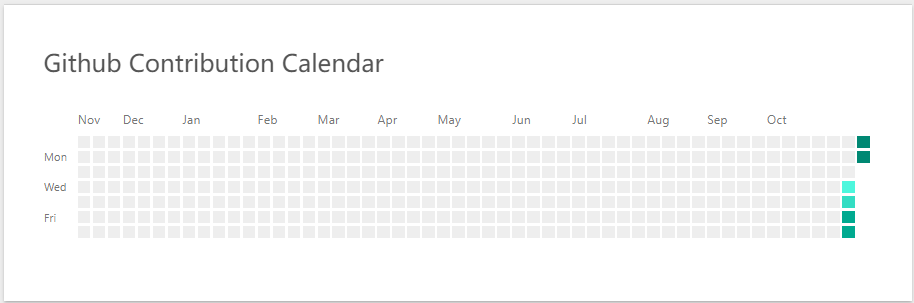
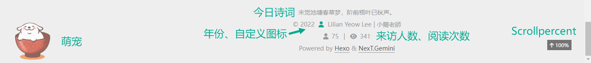
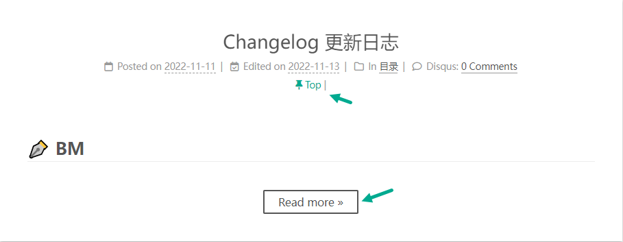

## 零、版本参数


<!--more-->

1. Git bash：2.38.1.windows.1
2. Node.js：v18.12.1
3. npm：8.19.3
4. Hexo：
   1. hexo-cli: 4.3.0
      os: win32 10.0.19043
      node: 18.12.1
      v8: 10.2.154.15-node.12
      uv: 1.43.0
      zlib: 1.2.11
      brotli: 1.0.9
      ares: 1.18.1
      modules: 108
      nghttp2: 1.47.0
      napi: 8
      llhttp: 6.0.10
      openssl: 3.0.7+quic
      cldr: 41.0
      icu: 71.1
      tz: 2022b
      unicode: 14.0
      ngtcp2: 0.8.1
      nghttp3: 0.7.0

5. Next：8.13.2

---


## 一、前置准备

1. 申请 GitHub 账号；
2. 安装 Git
   - 注意把自动分支选择 `main` 而非 `master`，因为远程仓库预设为 `main`，如果一个为 `main` （远程），一个为 `master` （本地），我遇到融合问题，无法解决——无法 `commit` & `merge` branch，尚未找到应对方法；
3. 安装 NodeJS；

---


## 二、远程仓库

1. 创建新仓库；
2. 把用户名作为部落格域名；
3. 新建 `index.html` 文件（要提交的网页代码先随便填，因为后续会修改）；
4. 在 Settings > Page 看见网页雏形，表示成功。

---


## 三、本地建站

1. 安装 `Hexo`，完了查看版本以确认成功（我操作时，无法选择位置，预设在用户文件夹之下，无法更改）；

   ```
   npm install -g hexo-cli
   hexo -v
   ```

2. 创建项目，并初始化，文件夹名字可自定义（该名字会自动成为根目录文件夹名字，且同样会位于预设用户文件夹内）；

   ```
   hexo init lilian-blog
   cd lilian-blog
   npm install
   ```

3. 本地启动，检验是否成功（浏览器访问 `http://localhost:4000`）。

   ```
   hexo g
   hexo server
   ```


---


## 四、安装主题

1. 下载安装 `next` 主题；

   ```
   cd 项目文件夹名称（进入文件夹根目录）
   git clone https://github.com/iissnan/hexo-theme-next themes/next
   ```

2. 更换主题为 `next`：打开根目录 `_config.yml` 文件（站点配置文件），检索 `theme` 改 `landscape` 为 `next` 。

   ```
   theme: next
   ```

3. 本地启动。

   ```
   hexo g -d
   hexo s
   ```


---


## 五、远程部署

1. 在本地创建 `.ssh` 秘钥文件夹（自动位于预设用户文件夹，与 hexo-blog 同一个根目录，不可以擅自移动位置）；

  ```
ssh-keygen -t rsa -C "GitHub注册邮件地址"
  ```

2. 生成后，打开用户目录，找到 `.ssh\id_rsa.pub` 文件，记事本打开并复制里面的内容，打开你的github主页，进入个人设置 -> SSH and GPG keys -> New SSH key；

3. 测试是否成功；

  ```
ssh -T git@github.com
  ```

4. 按照指示创造一段密码（每次远程部署时会用到）> 选择 `yes` > 看见 用户名 + “successfully” 通知表示成功完成任务，后面的 “does not provide shell access” 没关系；

5. 在 Git Bash 登入账号（已登入可免去此步骤）；

  ```
git config --global user.name "用户名"
git config --global user.email "注册 GitHub 邮箱地址"
  ```

6. 安装一键部署插件 `hexo-deployer-git` ；

  ```
cd 项目文件夹名称
npm install hexo-deployer-git --save
  ```

7. 修改根目录站点配置文件夹 `_config.yml` ，配置 `GitHub` 相关信息；

  ```
deploy:
  type: git
  repo: git@github.com:用户名/用户名.github.io.git
  branch: main
  ```

8. 删除 blog 根目录文件夹，如 `.deploy_git` 、`.git` 、`node_modules` 、`public`  等 ，只保留 `scaffolds` 、`source` 、`themes` 文件夹和 `.gitignore` 、`_config.yml` 、`db.json` 、`package.json` 和 `package-lock.json` 等；

9. 关联 GitHub 项目；

  ```
git init
git remote add origin https://github.com/用户名/用户名.github.io.git
  ```

10. 安装 Hexo；

    ```
    npm install -g hexo
    npm install
    hexo g -d
    ```

11. 如果成功部署，能够浏览网页，表示大功告成。若第 9-10 步失败，则尝试按照报错提示操作，再回到相应步骤。

---


## 六、主题优化

#### （一）修改浏览器 tab 页名称、作者

```
# Site
title: 站名
……
author: 英文名 | 中文名
```

  

#### （二）更改主题样式

检索 `Schemes`  ，内含四种 Next 样式，去除掉 `Gemini` 前面的 `#` 。


#### （三）更改网页图标

在 `next` `config.yml` 检索 `favicon` ，把事先放入 themes > next > source > images 的图像链接替换即可（包括 `small` 和 `medium` 2 张）。


#### （四）更改头像

在 `next` `config.yml` 检索 `avatar` 把事先放入 themes > next > source > images 的头像链接替换，并将 `displayed in circle` 改为 `true` 。


#### （五）设置 `分类` 、 `标签` 、 `关于我` 等新页面，加入首页导航中

1. 在 `next` `config.yml` 检索 `menu` ，然后将 `about` 、 `tags` 、 `categories` 、 `archives`  等所需项目前面的 `#` 去掉；

2. Git Bash 执行以下指令：

   ```
   hexo n page categories
   hexo n page tags
   hexo n page about
   ```

3. 于站点根目录 `source` 文件夹中，对应名字的文件夹分别找到它们的 `.md` 文档，在 3 份文档的文件首部信息，个别在 `title` 和 `date` 下方添加 `type: "about"` 、 `type: "tags"` 、 `type: "categpries"` ，注意冒号后必须有空格和开关引号。可以把全部 `title` 首字母改为大写，否则在网页呈现时，就会全是小写字母。


#### （六）侧边栏社交链接设置
在 `next` `config.yml` 检索 `Social Links` ，在自己需要的选项前去除掉 `#` 符号，接着修改条目后面的链接为自己的资料，即可显示。


#### （七）搜寻功能设置

1. 安装配置：

   ```
   npm install hexo-generator-searchdb --save
   ```

2. 在 `next` `config.yml` 检索 `local_search` ，把 `enable` 改为 `true` ；

3. 在根目录的站点配置文件 `_config.yml` 中加入搜索配置（extensions 下方）：

   ```
   search:
     path: search.xml
     field: post
     format: html
     limit: 10000
   ```


#### （八）设置 RSS 订阅

1. 安装配置：

   ```
   npm install hexo-generator-feed --save
   ```

2. 在根目录的站点配置文件 `_config.yml` 中，添加 `plugin` 项目于 `extensions` 下方：

   ```
   plugins: 
     hexo-generator-feed
   #Feed Atom
   feed:
   type: atom
   path: atom.xml
   limit: 20
   ```

3. 在 `next` `config.yml` 检索 `Social Links` ，把 `RSS` 条目前的 `#` 去除 。


#### （九）提交站点 sitemap

1. 安装配置：

   ```
   npm install hexo-generator-sitemap --save
   ```

2. 在根目录的站点配置文件 `_config.yml` 中加入站点地图（extensions 下方）：

   ```
   # sitemap
   sitemap:
     path: sitemap.xml
   ```


 #### （十）卜算子统计功能设置

 在 `next` `config.yml` 检索 `busuanzi` ，把 `enable` 、 `total_visitors` 、 `total_views` 和 `post_views` 全改为 `true` 。

- 【效果图见 `（二十四）` 条目配图】


#### （十一）侧边栏章节目录设置

在 `next` `config.yml` 检索 `toc` ，把 `enable` 和 `wrap` 设为 `true` ； `number` 设为 `false` ； `max_depth` 设为 `3` 。


#### （十二）Disqus 评论功能设置

1. 到点选 `GET STARTED` 注册 `disqus` 账号，然后选择 `I want to install Disqus on my site` ；
2. 依照后续指示填写相应资料： `Website Name` 、 `Category` 和 `Language` ；

- Website Name: 要注意这里是你的 disqus 专属网址的名称，会是 shortname.disqus.com  

3. 进到购买计划的部分，选择 `basic`  并点击 `Subscribe Now` ；
4. 下一页，拖到最后，选择 `I dont't see my platform listed, install manually with Universal Code` ；
5. 下一页，选择 `Balanced` 模式，就暂告一段落；
6. 回到本地，在 `next` `config.yml` 检索 `disqus` ，把 `enable` 和 `count` 改为 `true` ，`shortname` 则输入前面注册流程中填写的 `Website Name` 。


#### （十三）于首页显示文章摘要的 Read More 按钮设置

1. 在 `next` `config.yml` 检索 `Read more button` ，将 `read_more_btn` 部分修改为 `true` ；

2. 于每篇文章前面部分适当的地方，手动加入分割 `<!--more-->` 。

- 【效果图见 `（二十六）` 条目配图】


#### （十四）增加转载或引用文章的版权声明设置

1. 在 `next` `config.yml` 检索 `license` ，将 `Creative Commons 4.0 International Licens` 部分 `creative_commons` 的 `post` 修改为 `true` ；
2. 到根目录的站点配置文件 `_config.yml` 中，检索 `url` ，改 `http://example.com` 为自己的网址，如 `https://GitHub 用户名 .github.io`


#### （十五）阅览百分比

在 `next` `config.yml` 检索 `scrollpercent` ，把 `false` 改为 `true` ；

- 【效果图见 `（二十四）` 条目配图】


#### （十六）修改底部版权间隔红心图标

在 `next` `config.yml` 检索 `Social Links` ，于 `name` 修改为 `fa fa-user` 把红心替换掉，颜色代码则使用自己喜欢的颜色 Hex Code，如 `#808080`、 `#00aa90` 等；

- 【效果图见 `（二十四）` 条目配图】


#### （十七）修改网站底部年份

在 `next` `config.yml` 检索 `footer` ，于 `since` 修改对应年份；

- 【效果图见 `（二十四）` 条目配图】


#### （十八）修改文章底部 `#` 标签样式为图标

在 `next` `config.yml` 检索 `tag_icon` ，将 `Use icon instead of the symbol # to indicate the tag at the bottom of the post
    tag_icon` 设为 `true` 。 


#### （十九）取消分类、标签等页面的评论框

在个别对应的 `index.html` 文档首部资料中，加入一行 `comments: false` 即可。具体存放位置，参见本节 `第（五）条第三小节` 。


#### （二十）文章末端相关文章自动推荐

（已执行，未显现出来，成败未可知）

1. 安装配置：

   ```
   npm install hexo-related-popular-posts --save
   ```

2. 在 `next` `config.yml` 检索 `Related popular posts` ，把 `enable` 和 `display_in_home` 修改为 `true` ，在下一行加入以下配置：

   ```
   display_in_home: true
   params:
     maxCount: 5
     #PPMixingRate: 0.4
     #isDate: false
     #isImage: false
     #isExcerpt: false
   ```


#### （二十一）首页侧边栏热门文章自动推荐

（有可能同上，已执行，未显现出来，成败未可知）


#### （二十二）分享符号按钮及功能设置

（未完待续）


#### （二十三）GitHub 贡献日历设置

1. 打开 Blog > themes > next > layout 目录下的 `_layout.njk` 文件；

2. 找到 ``，在这条 twig 语句下方添加如下代码：

   ```
    
    	<div class="post-block animated fadeIn">
    		<h5 class="post-title" itemprop="name headline">
    			<a href="https://github.com/你的Github用户名" class="post-title-link" itemprop="url">Github Contribution Calendar</a>
    		</h5>
    		<div class="post-body animated fadeInDown" itemprop="articleBody">
    			
    		</div>
    	</div>
    
   ```

3. 注意修改 其中3 处为自己的 GitHub 用户名；
4. `ghchart.rshah.org/e77c8e/` 后面这六码是 Hex Code，可修改为自己喜欢的颜色；
5. 第一个大括号内的代码，要根据自己 Blog 的需求修改，以下引用大佬原文：
> 其中，page.type 是在对应页面的 index.md 文件的首部设置的，语句为 type: "对应类型"。
> 以 about 页面为例，page.type在 Blog\source\about 目录下的 index.md 文件的首部添加 type: "about"，如下（省略原出处引用的图片）：
> 因此，如果你不想在你的每篇文章顶部都显示贡献日历，那么你将不得不在每篇文章的 Markdown 文件首部都添加 type: "post"。（我在根目录底下的 `scaffolds` 文件夹的 `post.md` 文件首部添加了一次 `type: "post"` ，目前不需要每次都手动添加）
> 另外，如果你想让贡献日历显示在 about 页面，只需要将 page.type !== 'about' 删掉即可。

- 效果图：

  


#### （二十四）网站底部加上 “今日诗词”

在根目录 > themes > next > layout > `_layout.njk` 中 `footer` 部分，加入以下代码：

   ```
          <footer id="footer" role="contentinfo">
    
        <span id="jinrishici-sentence">正在加载今日诗词....</span>
        <script src="https://sdk.jinrishici.com/v2/browser/jinrishici.js" charset="utf-8"></script>

     </footer><!-- end #footer -->
   ```

- 完成后，示例如下：

   ```
        <footer class="footer">
          <div class="footer-inner">
            
            <footer id="footer" role="contentinfo">
      
          <span id="jinrishici-sentence">正在加载今日诗词....</span>
          <script src="https://sdk.jinrishici.com/v2/browser/jinrishici.js" charset="utf-8"></script>

      </footer><!-- end #footer -->
      
            {{ partial('_partials/footer.njk', {}, {cache: theme.cache.enable}) }}
          </div>
        </footer>
   ```

- 效果图：

  


#### （二十五）支持数学代码设置

（未完待续）


#### （二十六）文章置顶设置

1. 安装配置：

   ```
       npm uninstall hexo-generator-index --save
       npm install hexo-generator-index-pin-top --save
   ```

2. **图标配置**：打开 /themes/next/layout/_macro/ 目录下的 post.njk 文件，在以下代码的下方，插入再下显示的代码：

   ```
       <div class="post-meta-container">
                 {{ partial('_partials/post/post-meta.njk') }}
   ```
   
   ```
                 
                   <i class="fa fa-thumb-tack" style="color: #00aa90"></i>
                   <font color=00aa90>Top</font>
                   <span class="post-meta-divider">|</span>
                 
   ```

3. `Top` 文字和图标两者的颜色，可以使用自己喜欢的颜色 Hex Code；

4. 于要置顶的文章文档首部资料加上一行 `top: true` ；

5. 如果文章 >1，可设置 top 的值（大的在前面）以控制顺序，即在 `top: true` 下一行加上 `top: 1` 或 `top: 10` 等——数值越大的文章，会排在越靠前的位置。

- 效果图：

  


#### （二十七）萌宠/部落格宠物配置

1. 安装配置：

   ```
   npm install --save hexo-helper-live2d
   ```

2. 选择模型

   ```
   npm install live2d-widget-model-模型名（我用的是 `wanko` ）
   ```

3. 在根目录的站点配置文件 `_config.yml` 中，添加 `live2d` 项目于 `extensions` 下方：

   ```
   live2d:
     enable: true
     scriptFrom: local
     pluginRootPath: live2dw/
     pluginJsPath: lib/
     pluginModelPath: assets/
     tagMode: false
     debug: false
     model:
       use: live2d-widget-model-wanko
     display:
       position: left
       width: 145
       height: 150
     mobile:
       show: true
     react:
       opacity: 0.7
   ```

- 【效果图见 `23.` 条目配图】


#### （二十八）打赏功能设置

1. 在 `next` `config.yml` 检索 `reward_settings` ，把 `enable` 、 改为 `true` ;

2. 于 `reward` 处清单，去掉所需选项前面的 `#` ，并将事先放入 themes > next > source > images 的二维码链接替换。


#### （二十九）Liker 功能设置

（未完待续）


#### （三十）Google Adsense 功能设置

（未完待续）


#### （三十一）增加其他新页面

做法于新增 `About` 、 `Categories` 、 `Tags` 等一样，可参考官方文档，但是我自己的尝试一直有 bug ，即在导航侧边栏的清单，图标后文字与原有的文字对不准，尝试了各种方案也没找到正确的解决方法，暂时先用 `.` 和空格糊弄过去。TvT 网上似乎没找到有人拥有一样的问题。

- 记得处理好之后，到 themes > next > languages > en.yml 文档中 `menu` 清单去添加自己新增的页面翻译。


## 七、基本操作

#### （一）常用 git 指令

1. 登入关联账号：

   ```
   git config --global user.name "用户名"
   git config --global user.email "用户邮箱地址"
   ```

2. `cd blog根目录文件夹名称` 进入文件夹


#### （二）常用 Hexo 指令

  1. hexo clean / hexo c：清除；
  2. hexo generate / hexo g：生成；
  3. hexo deploy / hexo d：远程部署；
  4. hexo server / hexo s：伺服器页面展示；
  5. hexo g -d：快速生成部署（一键生成、推送到远程仓库）
  6. hexo c && hexo g && hexo d：一键三连。

  - 一旦使用 `hexo deploy` 或是包含 `hexo d` 指令，就需要输入配置 .ssh 秘钥时设置的那串密码。


#### （三）创建文章

  ```
hexo n post 文章名字
  ```


#### （四） 引用图像/插入图片

安装插件 > 修改配置文件 > 文章文档以 Markdown 语法插入图片即可；

   ```
   npm install https://github.com/CodeFalling/hexo-asset-image --save
   ```

   1. 在 `next` `config.yml` 检索 `post_asset_folder` ，修改为 `true` ；

      ```
      post_asset_folder: true
      ```

   2. 完成上步设置后，我们新建文章的同时，也会创建与文章同名的文件夹用来存放图片；

   3. 文档中插入图片的 Markdown 语法示例如下，注意斜杠放反了，就会失败，导致图片无法显示：

   ```
      
   ```


#### （五）插入 YouTube 影片

可添加代码如下：

```

```

- 其中，video_id 需用自己影片 ID 替换，例如， X85DcsKHaUo 


#### （六）实现文章多级分类

在文章文档首部资料内的 `categories` 条目中，用；列清单的方式写入多个类别，示例如下：

   ```
   categories:
     - 工具
     - hexo
   ```

   - 此一例中，“工具” 为 “hexo” 的上一级。


#### （七）输入多个文章标签

   同上。

   ```
   tags:
     - Testing
     - Another Tag
   ```

   - 标签还有第二种输入方式：

   ```
   tags: [Testing, Another Tag]
   ```


#### （八）实现高亮

```
<span style="background-color:#FFF000">XXX</span>
```

效果测试如下：

- 我是文本中需要<span style="background-color:#00aa90">高亮的字体</span>。ヽ(* ^ｰ^)人(^ｰ^ *)ノ


#### （九）改变字体颜色

```
<font color="#FF0000">XXX</font>
```

效果测试如下：

- 我是文本中需要<span style="background-color:#00aa90"><font color="#FFFFFF">高亮的字体</font></span>。ヽ(* ^ｰ^)人(^ｰ^ *)ノ


## 八、插件总结

#### （一）一键部署

```
npm install hexo-deployer-git --save
```

- 在根目录的站点配置文件 `_config.yml` 中，修改 `deploy` 项目：

   ```
  # Deployment
  
  ## Docs: https://hexo.io/docs/one-command-deployment
  
  deploy:
    type: git
    repo: git@github.com:用户名/用户名.github.io.git
    branch: main
  ```


#### （二）站内搜索

```
npm install hexo-generator-searchdb --save
```

- 在 `next` `config.yml` 检索 `local_search` ，把 `enable` 改为 `true` ；

- 在根目录的站点配置文件 `_config.yml` 中加入搜索配置（extensions 下方）

   ```
  search:
    path: search.xml
    field: post
    format: html
    limit: 10000
  ```


#### （三）RSS 订阅

```
npm install hexo-generator-feed --save
```

- 在根目录的站点配置文件 `_config.yml` 中，添加 `plugin` 项目于 `extensions` 下方：

   ```
  plugins: 
    hexo-generator-feed
  #Feed Atom
  feed:
  type: atom
  path: atom.xml
  limit: 20
  ```

- 在 `next` `config.yml` 检索 `Social Links` ，把 `RSS` 条目前的 `#` 去除 。

  

#### （四）站点地图

```
npm install hexo-generator-sitemap --save
```

- 在根目录的站点配置文件 `_config.yml` 中加入站点地图（extensions 下方）：

   ```
  # sitemap
  sitemap:
    path: sitemap.xml
  ```


#### （五）文章推荐

```
npm install hexo-related-popular-posts --save
```

- 在 `next` `config.yml` 检索 `Related popular posts` ，把 `enable` 和 `display_in_home` 修改为 `true` ，在下一行加入以下配置：

   ```
    display_in_home: true
    params:
      maxCount: 5
      #PPMixingRate: 0.4
      #isDate: false
      #isImage: false
      #isExcerpt: false
   ```

#### （六）文章置顶

```
npm uninstall hexo-generator-index --save
npm install hexo-generator-index-pin-top --save
```

1. 图标配置：打开 /themes/next/layout/_macro/ 目录下的 post.njk 文件，在以下代码的下方，插入再下显示的代码：

   ```
   <div class="post-meta-container">
             {{ partial('_partials/post/post-meta.njk') }}
   ```

   ```
             
               <i class="fa fa-thumb-tack" style="color: #00aa90"></i>
               <font color=00aa90>Top</font>
               <span class="post-meta-divider">|</span>
             
   ```

2. `Top` 文字和图标两者的颜色，可以使用自己喜欢的颜色 Hex Code。

3. 于要置顶的文章文档首部资料加上一行 `top: true` ；

4. 如果文章 >1，可设置 top 的值（大的在前面）以控制顺序，即在 `top: true` 下一行加上 `top: 1` 或 `top: 10` 等——数值越大的文章，会排在越靠前的位置。


#### （七）Live2D

1. 安装配置

   ```
   npm install --save hexo-helper-live2d
   ```

2. 选择模型

   ```
   npm install live2d-widget-model-模型名（我用的是 `wanko` ）
   ```

3. 在根目录的站点配置文件 `_config.yml` 中，添加 `live2d` 项目于 `extensions` 下方：

   ```
   live2d:
     enable: true
     scriptFrom: local
     pluginRootPath: live2dw/
     pluginJsPath: lib/
     pluginModelPath: assets/
     tagMode: false
     debug: false
     model:
       use: live2d-widget-model-wanko
     display:
       position: left
       width: 145
       height: 150
     mobile:
       show: true
     react:
       opacity: 0.7
   ```


## 九、踩坑记录

1. 如果误删根目录 > public > `index.html` ，本地及远程仓库都没了这个文件，网站无法显示，变成 `404` ，且无法使用指令退回前面版本时，笨方法是，把旧版本的 `index.html` 内容复制了，在远程仓库和本地 `public` 文件夹都重建一个同名文件，并把所复制的内容贴回去，然后重新生成部署——不能只在其中一个地方，即本地或远程仓库重建该文件，因为重新部署后，两边会同步，从而把刚刚补上的 `index.html` 再次删除掉，徒劳无功。


### Resources：

1. [GitHub Pages + Hexo搭建个人博客网站，史上最全教程](https://blog.csdn.net/yaorongke/article/details/119089190)
2. [Hexo 博客在换了电脑或者重装系统后如何在新电脑恢复](https://codeantenna.com/a/YxMbXzXhGj)
3. [官方文档](https://theme-next.js.org/)
4. [手把手教你在Hexo中使用Github贡献日历（以Next主题为例）](https://gagalab.tech/2021/07/14/Next%E4%B8%BB%E9%A2%98%E4%BD%BF%E7%94%A8Github%E8%B4%A1%E7%8C%AE%E6%97%A5%E5%8E%86%E6%95%99%E7%A8%8B/)
5. [hexo nexT7.8.0博客显示图片（非图床方法）](https://blog.csdn.net/TheSeasonSun/article/details/124828915)
6. [QUESTION:　如何在 Hexo or Markdown 插入 youtube 影片呢？](https://theriseofdavid.github.io/2020/10/10/blog/hexo-insert-movie/)
7. [基于hexo、next主题和github的个人博客搭建](https://kevin0048.github.io/2020/04/17/%E5%9F%BA%E4%BA%8Ehexo%E3%80%81next%E4%B8%BB%E9%A2%98%E5%92%8Cgithub%E7%9A%84%E4%B8%AA%E4%BA%BA%E5%8D%9A%E5%AE%A2%E6%90%AD%E5%BB%BA/)
8. [Hexo-Next 主题博客个性化配置超详细，超全面(两万字)](https://blog.csdn.net/as480133937/article/details/100138838)
9. [Hexo-NexT 博客使用插件总结](https://www.yousazoe.top/archives/c12c9c40.html)
10. [基于Hexo+Next的主题优化总结&踩过的坑](https://www.jianshu.com/p/53670692c5a6)
11. [Hexo 新增 Disqus 留言板功能](https://blog.balabambe.com/2021/07/31/Hexo-%E6%96%B0%E5%A2%9E-Disqus-%E7%95%99%E8%A8%80%E6%9D%BF%E5%8A%9F%E8%83%BD/)


### Changelog：

- 2022-11-15 
  - 简完善 ##六 ####（十二）~（十四）节；

  - 新增第（十九）节；

  - 新增 ##七 ####（五）~（六）节。

- 2022-11-14 简创建，完成初稿。
